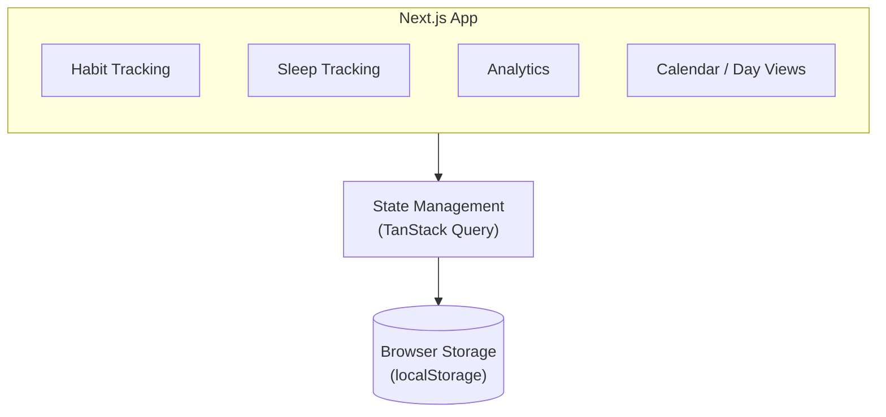

# HabitSense

A modern habit and sleep tracking app designed to make everyday routines easier to track, understand, and improve.

HabitSense brings habit tracking, sleep logging, streaks, and progress analytics into one simple interface. The app focuses on making consistency visible through calendars, trends, and actionable statistics.

---

## What's Inside

### Habit Tracker

* **Monthly Calendar Matrix** — View the entire month with color-coded habit completion and daily scores.
* **Mobile Day View** — Focused daily checklist with a swipeable 7-day navigation strip.
* **3-State Checkboxes** — Cycle between unmarked, completed, and missed.
* **Habit Archiving** — Archive habits without losing historical progress.
* **Completion Scores** — Track daily and monthly consistency across habits.

### Sleep Tracker

* Log sleep duration in **15-minute increments**.
* View sleep trends over time.
* Track average sleep duration.
* Browse, edit, and review previous sleep records.

### Analytics

* **30-Day Consistency Trend** — Visualize consistency over time.
* **Monthly Highlights** — See your best day, most consistent habit, and most-missed habit.
* **Statistics Table** — Sort habits by completion rate and streaks.
* **Progress Visualization** — Understand patterns through charts and aggregated statistics.

### Offline-First

* Works without requiring an account.
* Stores application data directly in browser storage.
* Supports JSON data export and restoration.
* Installable as a **Progressive Web App (PWA)**.
* Supports offline usage after installation.

---

## Tech Stack

| Category      | Technology            |
| ------------- | --------------------- |
| Framework     | Next.js (App Router)  |
| Language      | TypeScript            |
| Styling       | Tailwind CSS          |
| Charts        | Recharts              |
| State / Data  | TanStack Query        |
| Icons         | Lucide React          |
| Date Handling | date-fns              |
| Storage       | Browser Local Storage |
| PWA           | Progressive Web App   |

---

## Architecture

HabitSense follows a client-side, local-first architecture.



The application does not require a backend API or cloud database for its core functionality, allowing the app to work directly from the browser.

---

## Running Locally

### Clone the repository

```bash
git clone https://github.com/palakbhatt1/HabitSense.git
cd HabitSense
```

### Install dependencies

```bash
npm install
```

### Start the development server

```bash
npm run dev
```

Open `http://localhost:3000` in your browser.

---

